# 文件說明

## 建立動機
---
紀錄 RDS 還原相關操作步驟  

## 文件描述
---
2025/5/13 於 PFH eshop 開發自行上傳 Excel，導致部分 Table 資料錯誤，故申請回滾至 2025/5/12。  
由於並無事前通知備份 DB，故利用 RDS 自動備份檔還原相關 Table。  

本文將說明在 RDS 上如何操作自動備份檔做還原，以及利用已還原的新執行個體進行部分 Table 還原。  

<p class="callout info" id="mrk-1">首次操作 RDS，若有說明不足或錯誤之處請不吝於指正。</p>  
<p class="callout info" id="mrk-2">本文包含在 PC 以 HeidiSQL 操作 DB 備份還原步驟僅供參考，實際以個人使用習慣為主。</p> 


# 操作說明或步驟

## RDS 還原操作
---
#### 1. 檢查最早可還原時間點
進入目標 RDS 執行個體，點選「維護與備份」
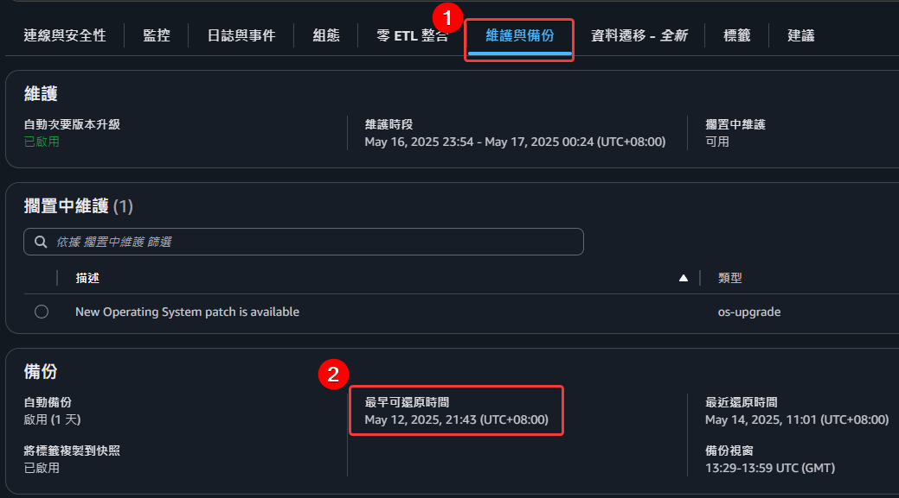  

#### 2. 還原至時間點
相同頁面中於右上「動作」點選「**還原至時間點**」  
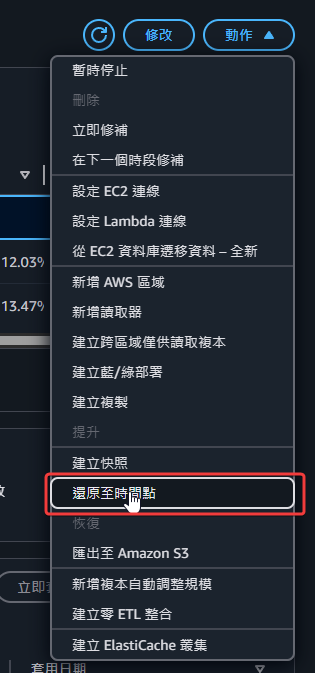  

**自訂日期和時間**：需大於最早可還原時間點，否則會通知錯誤無法建立還原  
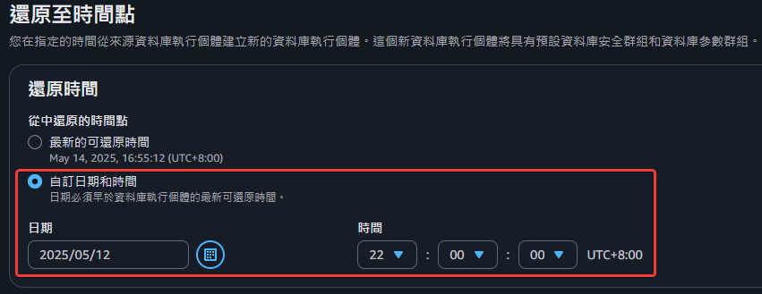  

**資料庫執行個體識別符**：自訂新的執行個體名稱  
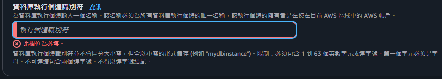  

**容量範圍**：可參考原執行個體做設定  
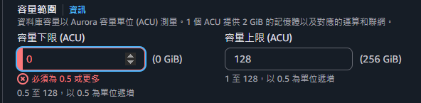  
原執行個體設定   
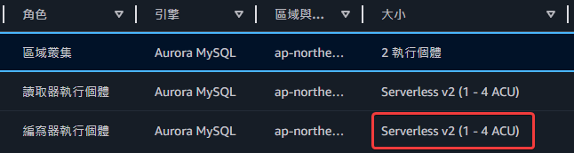

**還原至時間點**：其他設定維持預設值，下滑至頁面底部點選「還原至時間點」，接著系統會建立新執行個體  
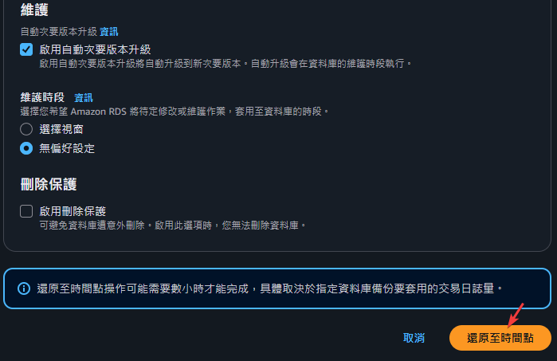  

#### 3. 查看新執行個體端點連線資訊
進入新執行個體複製端點資訊，用於 PC 連接使用  
下列端點位置皆可連線成功，暫不清楚差別：  
* 端點1：  
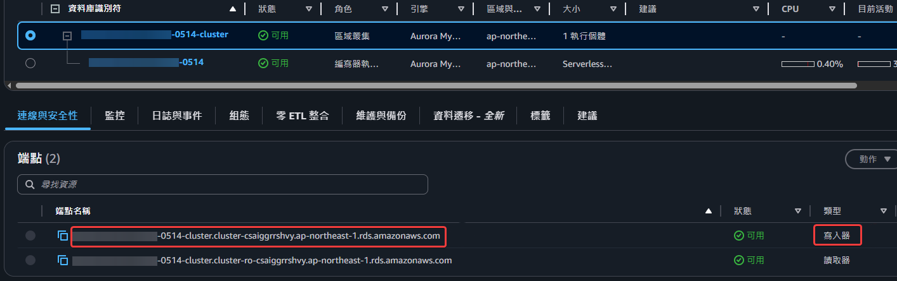  
<br>
  
* 端點2：  
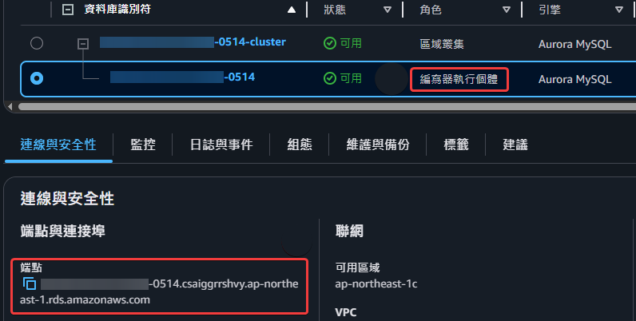  

## 在 PC 使用 HeidiSQL 做還原
---
#### 1. 連線至新執行個體
複製原有連線設定，只更改主機名稱  
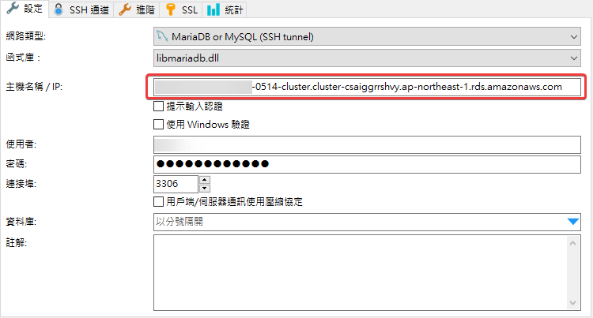   

#### 2. Export 新執行個體的 DB
進入目標 DB 後  
點選「工具」選擇「匯出資料為 SQL 腳本」  
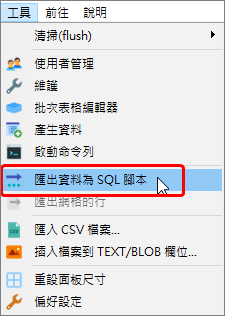  

確認 <font color=FF0000>相關設定</font> 後匯出 DB（需包含 Table 結構+資料）  
並記錄欲還原 Table <font color=#008000>個別筆數</font>，做為稍後還原核對使用  
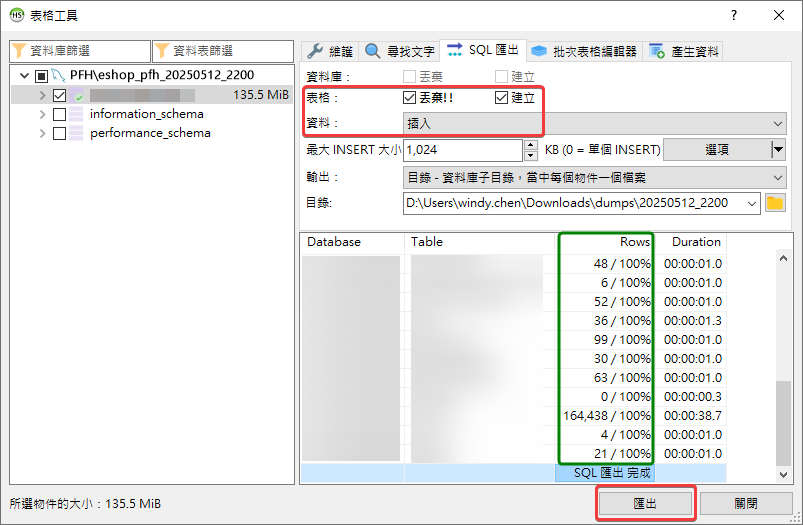  

匯出的 SQL 檔即為 RDS 還原之資料（時間點：2025/5/12 22:00:00）  
挑選欲還原的 Table SQL 檔，做為稍後還原使用    
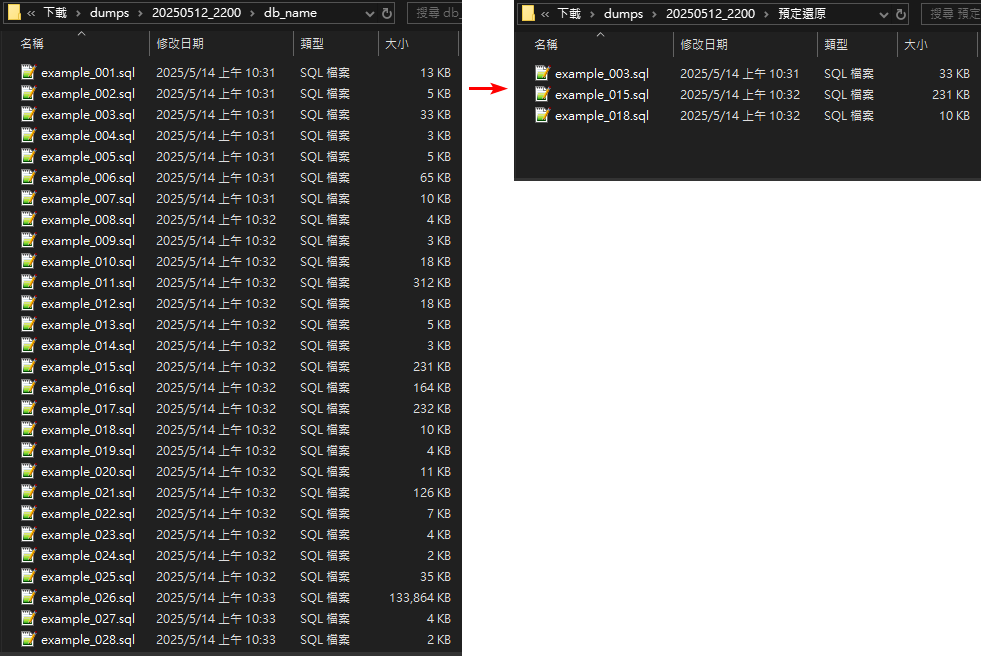

#### 3. 備份原專案中的 DB
<p class="callout warning" id="mrk-3">在執行還原 SQL 前先備份 DB，以防還原時操作失誤。</p>  

可於「PC」或「RDS」做備份  
* PC 備份  
  在 HeidiSQL 切換至原 eshop 專案中出問題的資料庫  
  一樣使用「匯出資料為 SQL 腳本」工具匯出 SQL  
  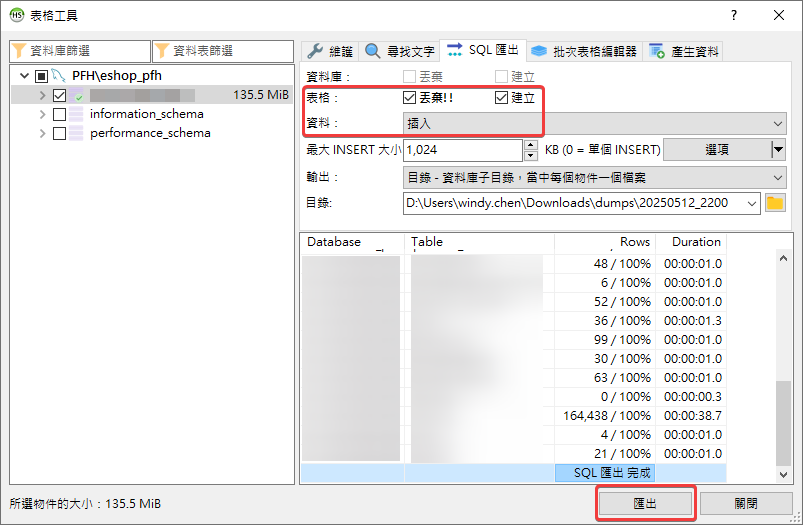  
<br>
* RDS 快照  
  進入 RDS 原專案的執行個體，選擇頁籤「維護與備份」  
  下滑至「快照」區塊，點選「建立快照」  
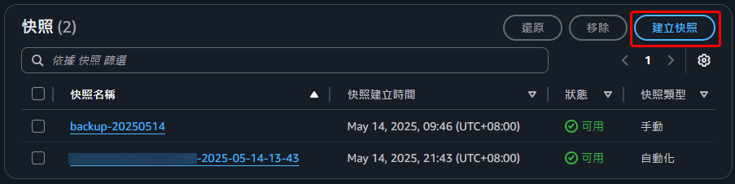
  自訂快照名稱後，點選「建立快照」  
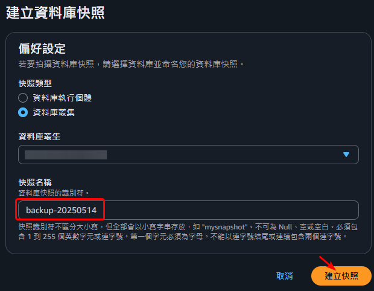  

#### 4. Import 新執行個體 Table 至原專案中的 DB
在 HeidiSQL 開啟原 PFH eshop 專案中的資料庫  
並將 <font color=FF0000>新執行個體</font> 的 SQL 檔開啟，複製內容至 HeidiSQL 貼上（或在「檔案」點擇「載入 SQL 檔案」）  
<p class="callout info" id="mrk-3">若匯出時有觸發器 SQL 檔，需要跟著執行，因為在 Drop Table 時，原本的觸發器會消失。</p>  

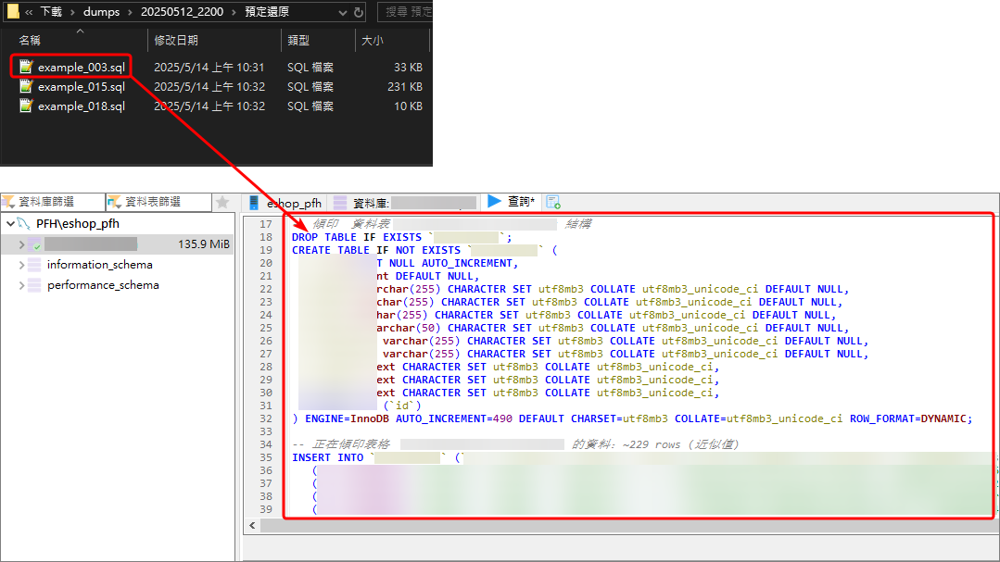  

接著執行查詢做還原的動作（SQL 檔的執行順序: 刪除既有 Table, 建立新 Table, 匯入原有 Data）  
執行完成後檢查下方系統提示，查看是否有問題  
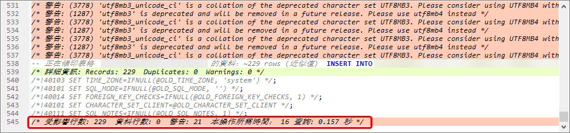

當逐個 SQL 檔執行完成後，按下「F5」重新整理    
進入資料庫頁面，核對已還原的 Table 筆數是否正確  
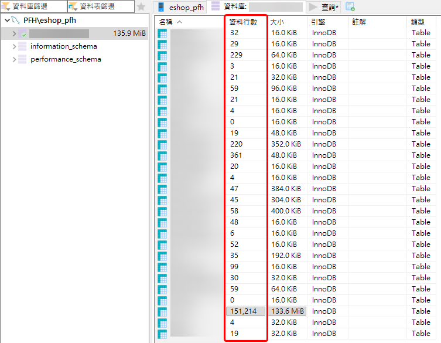  

系統表顯示的筆數有時會不正確 (非當前最新狀態)  
若有疑問以 SQL 查詢正確筆數  
```
SELECT COUNT(*) FROM table_name;
```

# 補充
## 刪除新執行個體
---
新執行個體在匯出 DB 資料及確認沒問題後，於 RDS 進行刪除以降低資源占用。

## 較安全的 Table 還原方式
---
<p class="callout info" id="mrk-4">執行還原 SQL 前先將 SQL 內新建 Table 改名 (xx<font color=FF0000>_new</font>)，待執行後確認新表沒問題，再使用 <font color=FF0000>RENAME 同時替換</font>新舊 Table 名稱。</p>  
<p class="callout info" id="mrk-5">原因：可先確保還原的 Table 一切無誤後，再替換運行中的 Table，避免運行中的 Table 有瞬間中斷及資料消失之情況。</p>

#### 1. Export DB 後先修改 SQL 檔中的表名
修改 SQL 檔中的 Table 名稱  
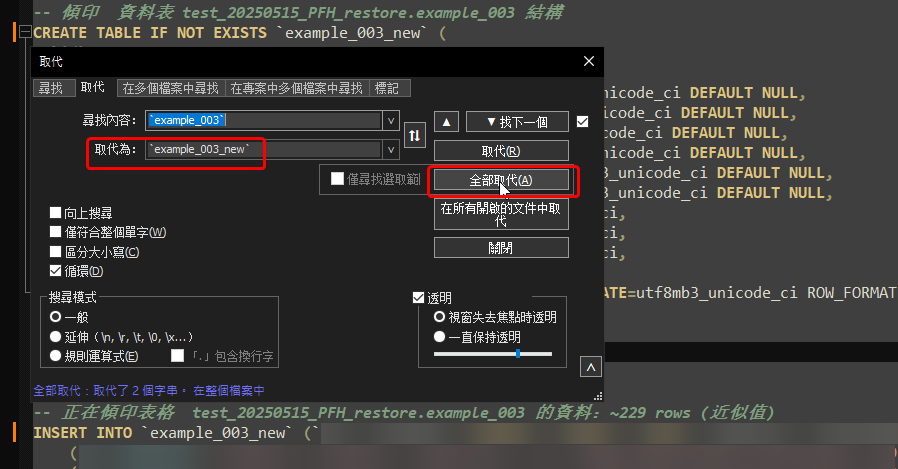  

#### 2. 執行 SQL 檔，並檢查新 Table 相關資訊（例如結構及資料筆數）
執行 SQL 檔建立新表  
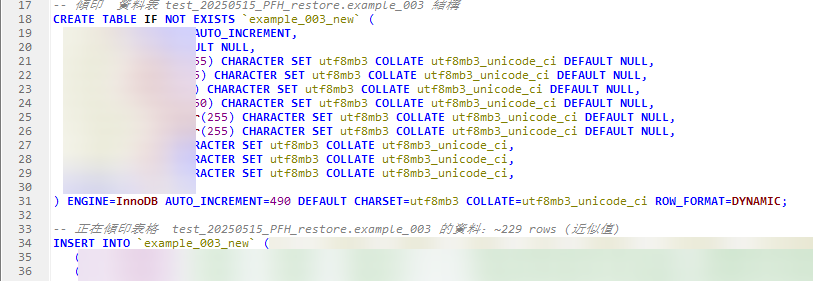  

檢查筆數  
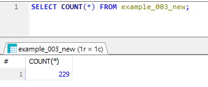  

#### 3. 確認沒問題後將新舊 Table 名稱替換
使用 RENAME 可同時替換多張表  
<font color=FF0000>注意順序</font>：先改運行中的表名，再改新建的表名  
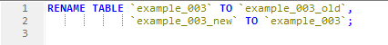  

執行 RENAME 後，檢查確實已替換完成  
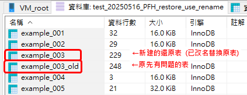  

<p class="callout info" id="mrk-5">若有觸發器 SQL 檔，則在 RENAME 後執行。因為既有的觸發器會跟著舊表名，執行觸發器 SQL 檔後會更新為正確表名。</p>

#### 4. 刪除舊 Table
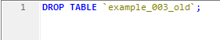  

#### 參考資料
[MYSQL] RENAME TABLE Statement  
https://dev.mysql.com/doc/refman/8.4/en/rename-table.html