# Tableau Desktop 新增 BigQuery 連線 & 資料來源取代
## 新增BigQuery連線

#### Step1. 在連線窗格中選取 Google BigQuery

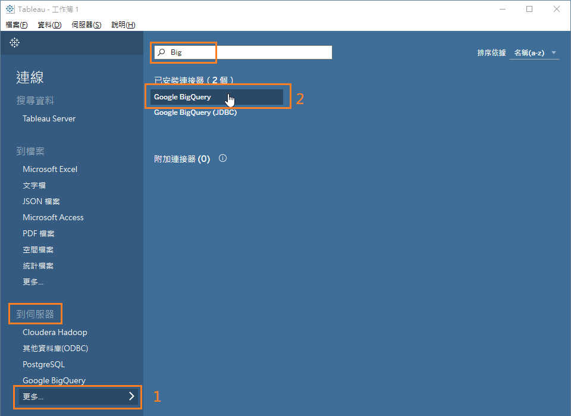

#### Step2. 選擇驗證的方式 (共2種)

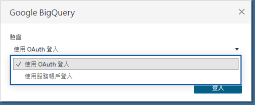

##### 1. 使用 OAuth 登入 (WebUI)

依照Web頁面指示，登入帳號及同意授權權限給Tableau。  
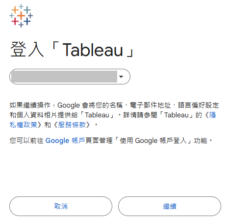 
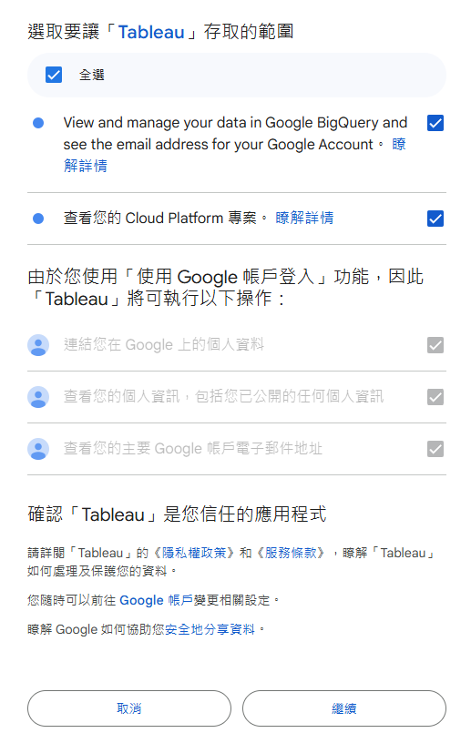 

##### 2. 使用服務帳戶登入(JSON檔案)
> Tableau Server 2020.4.4 不支援此方法

選擇驗證用的JSON檔案登入  
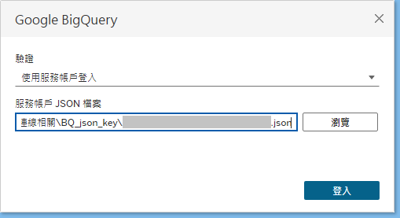

#### Step3. 選擇欲使用的BigQuery專案

選擇專案後即可讀取數據庫及資料表，用於後續報表設計。  
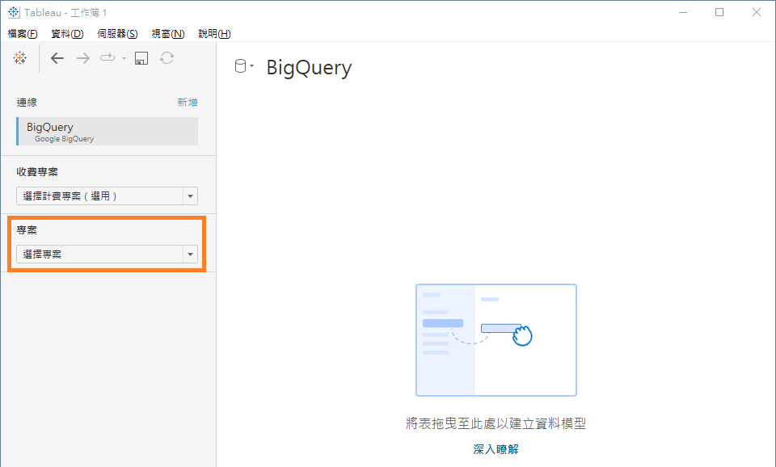

   

---
## 將既有資料來源取代成BigQuery

> 目前測試出兩種取代方式:
> 
> A. 在既有資料來源中 **逐一取代 table** (如果主表為自訂SQL查詢則無法採用此方法)  
> B. 另外新增資料來源後，使用內建工具取代 **整個資料來源**

### A. 在既有資料來源中逐一取代 table

#### step1. 開啟欲替換的資料來源頁面，點兩下邏輯資料表進入實體層頁面
邏輯層頁面  
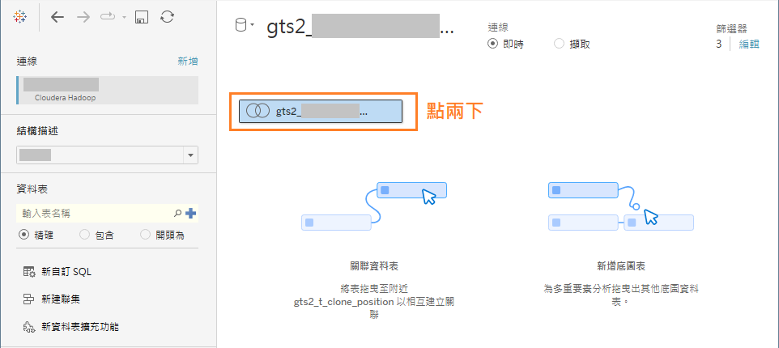  

實體層頁面  
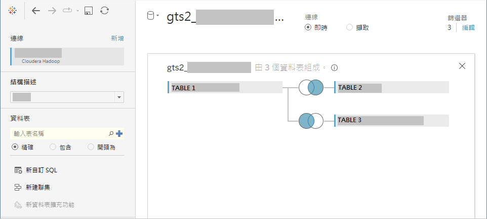

#### step2. 在左側窗格中新增BigQuery連線
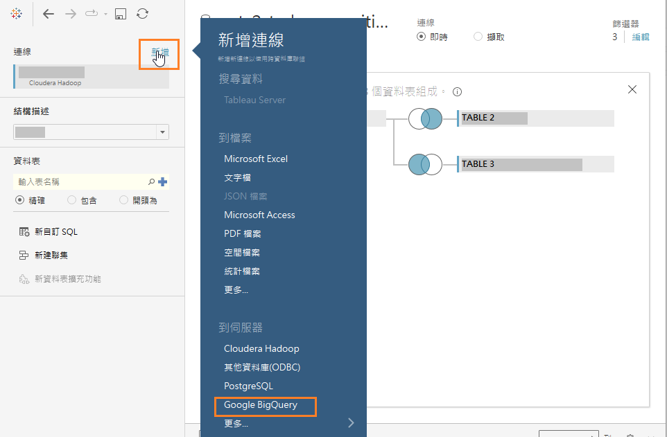

#### step3. 搜尋BigQuery中對應的table
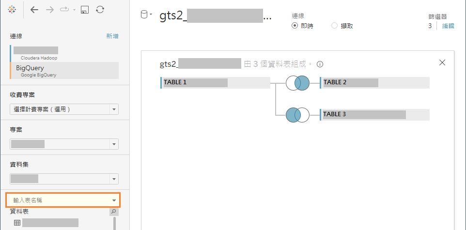

#### step4. 逐一替換table

##### 1. 非自訂SQL查詢 (直接 table 替換 table)
選取左側窗格 BigQuery 中 table，拖曳到右側要替換的 table 後放開，即完成取代。  

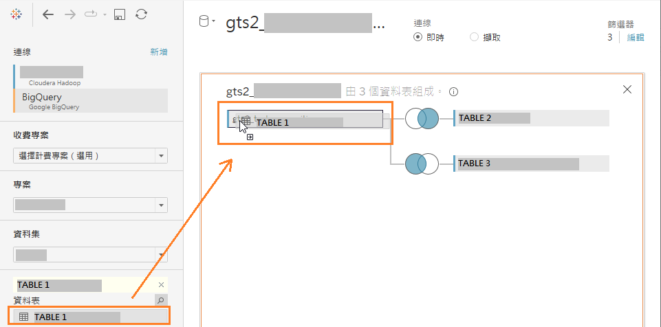

##### 2. 自訂SQL查詢 (移除舊SQL查詢，重新建立SQL查詢)

* **複製既有 SQL 語法**  
  點選 table 右側小箭頭，選擇"編輯自訂SQL查詢"。  
  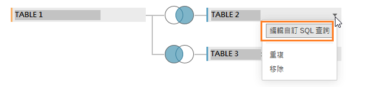

  跳出窗格後複製 SQL 語法  
  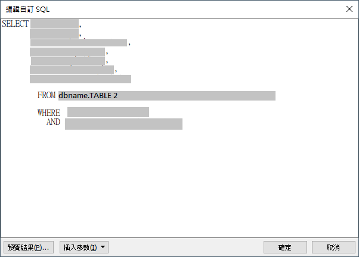

 

* **移除舊有table**  
  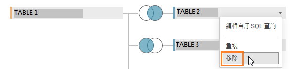 

 

* **重新建立 SQL 查詢**  
  左側窗格中點選"新自訂SQL"  
  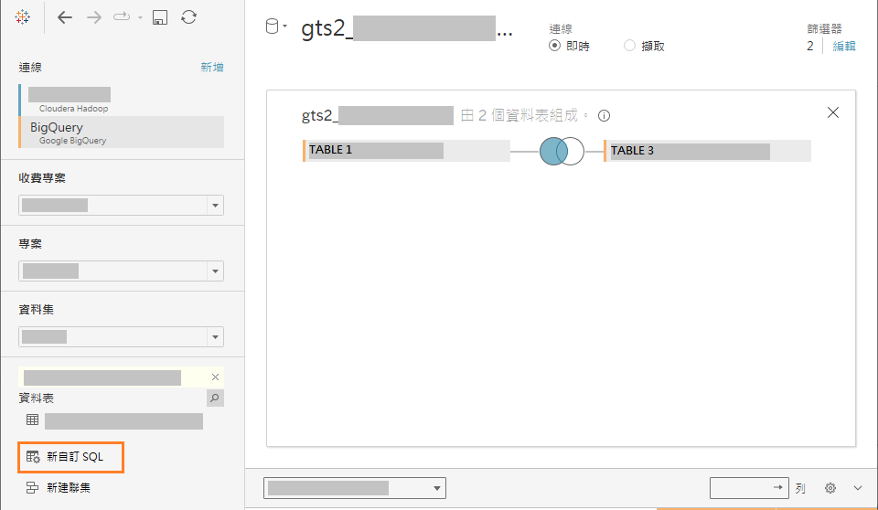
    
  貼上 SQL 語法並修改來源字段 (FROM ...)，加入 BigQuery 專案名稱。
  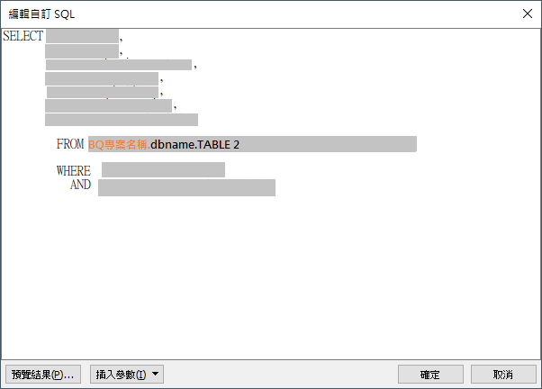
     
  點選確認後即產生新的實體資料表  
  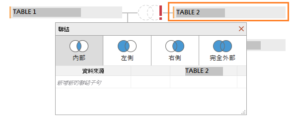 
     
  依相同條件建立資料關聯 (可另開原 tableau 檔在旁做比對)  
  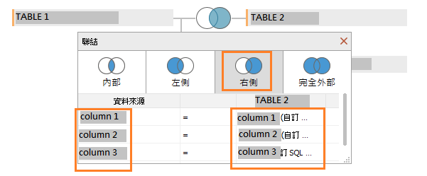 

#### step5. 檢查篩選器條件是否與原本的一致
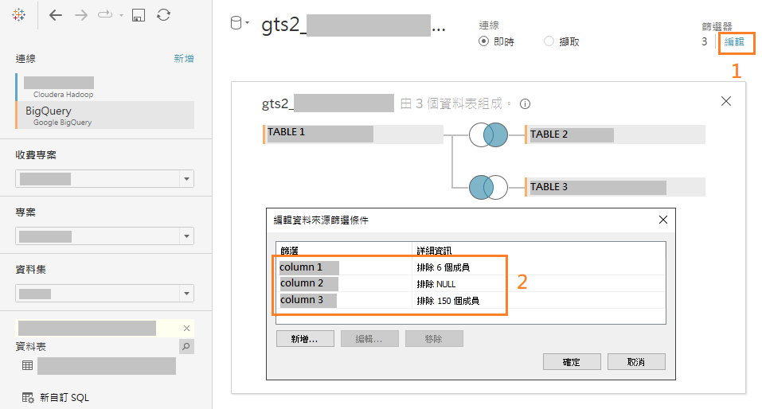 

#### step6. 移除舊連線 
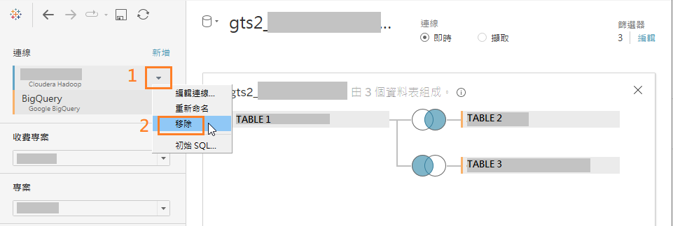  

   
   

---

### B. 另外新增資料來源後，使用內建工具取代整個資料來源

#### step1. 點選工具列中"資料"，選擇"新增資料來源"
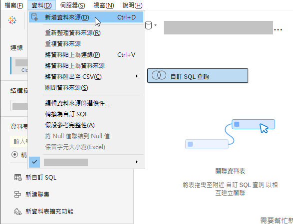  

#### step2. 新增BigQuery連線
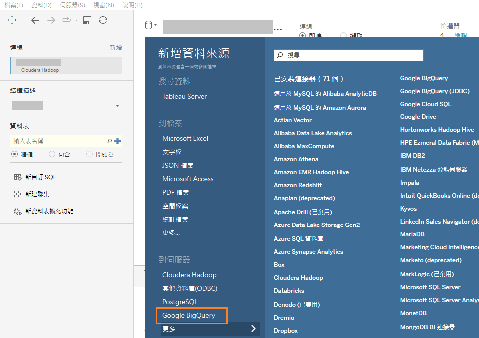  

#### step3. 依照原本串接關係，在新資料來源中創建相同的表及關聯
參考原資料來源(這裡是Hadoop)  
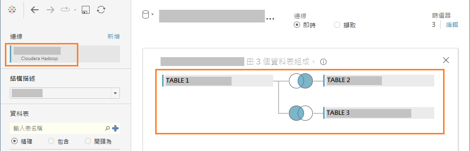  

在新資料來源(BigQuery)中建立相同關聯  
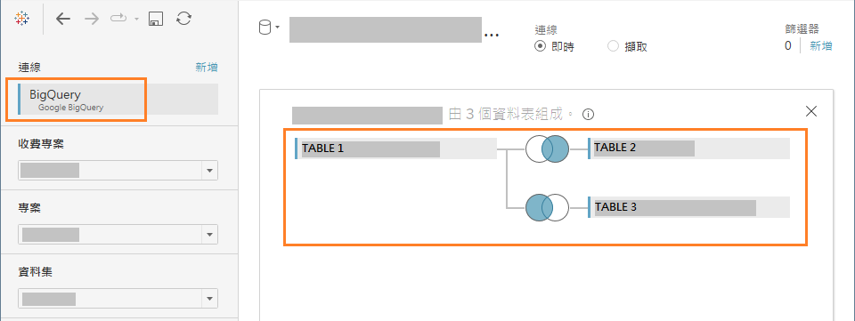  

#### step4. 新增篩選器與原有的一致
點選右上的篩選器新增  
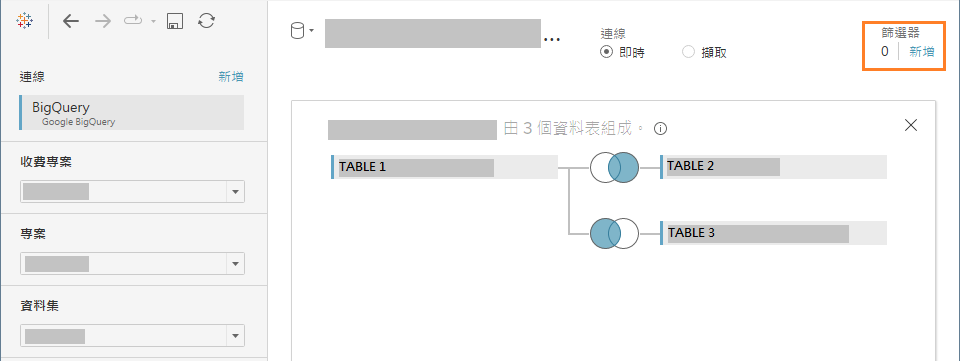  

參考原有的篩選器做配置  
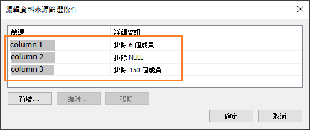  

#### step5. 使用內建工具取代整個資料來源
**先切換至任一工作表頁籤**，點選工具列中"資料"，選擇"取代資料來源"。  
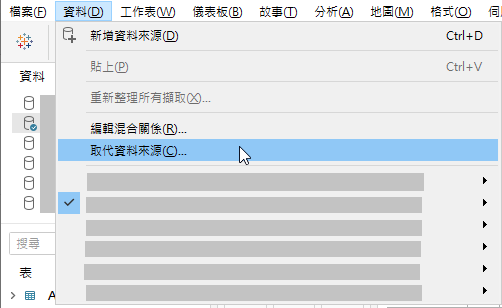  

選取欲替換的資料來源後確定  
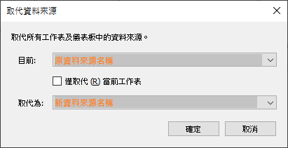  

#### step6. 移除舊資料來源
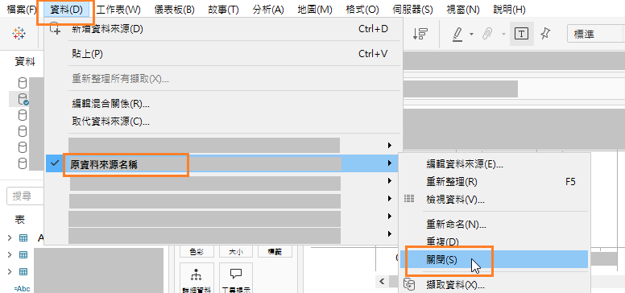  

### 補充
> **重設自訂SQL查詢**，或是**替換整個資料來源**時，欄位可能會有一些細微差異 (例如: Tableau會自動產生欄位別名)，依照狀況可參考下列方法做調整嘗試。

#### 欄位名稱重設
切換至資料來源頁面，點選欲重設名稱的邏輯資料表。  
點選下方第一個欄位後按住Shift，然後滑動到最底部，滑鼠點一下最後一個欄位，即可全選欄位。(或依需要的範圍選取)  
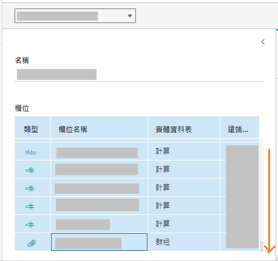  

滑鼠右鍵點選任一欄位，選擇"重設名稱"，即可將選取的欄位名稱還原成原始欄位名稱。  
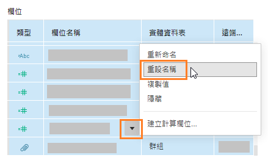  

#### 欄位型別更換
部分**數字**欄位在原資料來源中，維度被更換成**字串**欄位，但是透過替換整個資料來源後，可能沒有跟著變動，此時透過手動拖曳來重現。  
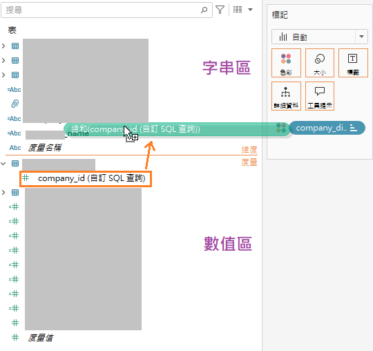   

#### 欄位/公式異常處理
由於Tableau自動產生欄位別名，造成欄位名稱的不同，公式可能會找不到相同的欄位名稱因此報錯(顯示驚嘆號)。  
可透過右鍵欄位選擇"取代引用"，手動替換成新的正確欄位名稱。(使用相同欄位的公式會自動跟著調整)  
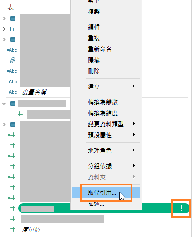 

## 參考資料 
* Google BigQuery - Tableau  
[https://help.tableau.com/current/pro/desktop/zh-tw/examples_googlebigquery.htm](https://help.tableau.com/current/pro/desktop/zh-tw/examples_googlebigquery.htm)  

* 取代資料來源 - Tableau  
[https://help.tableau.com/current/pro/desktop/zh-tw/connect_basic_replace.htm](https://help.tableau.com/current/pro/desktop/zh-tw/connect_basic_replace.htm)